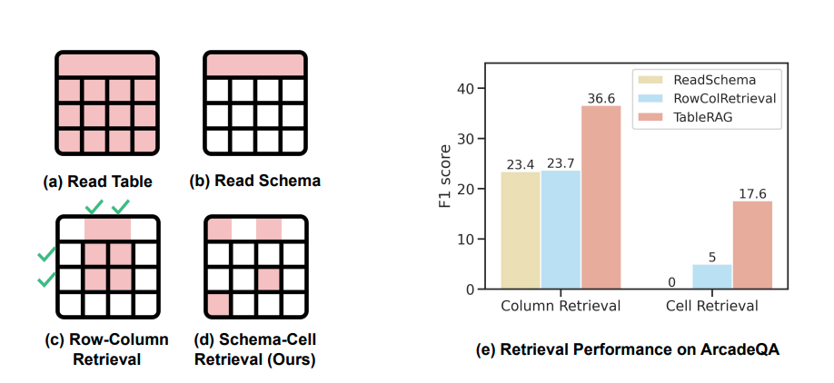
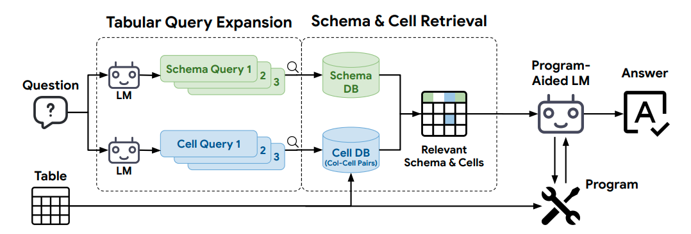
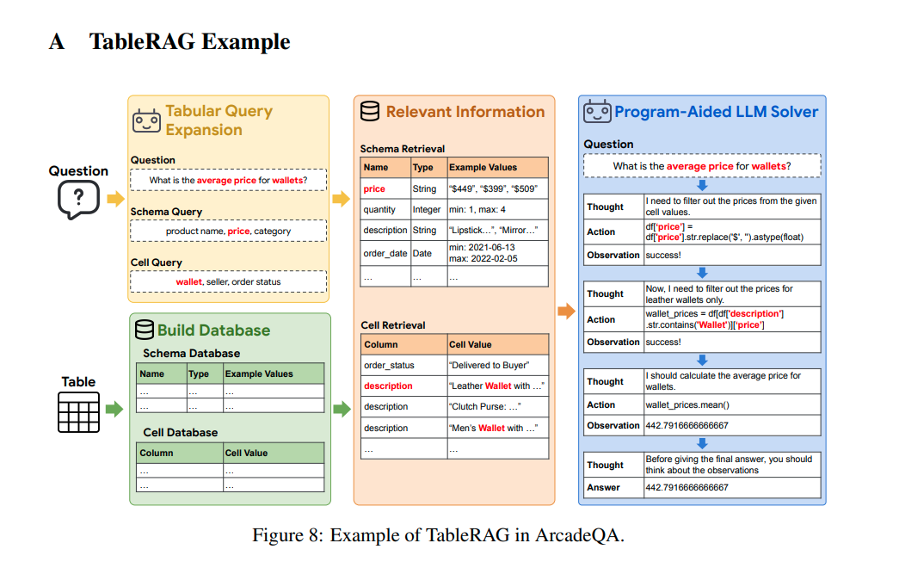
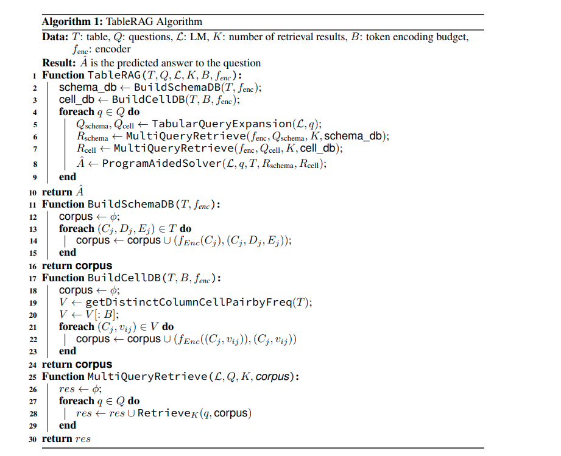

# TableRAG

## 概述

### 1. 背景与挑战

- 背景：随着自然语言处理技术的发展，现代语言模型已经能够处理复杂的文本信息，并且在某些情况下可以对表格数据执行基本的理解和推理任务。然而，当涉及到非常大的表格时，传统的处理方式会遇到一些限制。
- 挑战：
    - 上下文长度限制：大多数语言模型都有一个固定的输入序列长度上限，这限制了它们一次性处理的数据量。
    - 位置偏差：对于大型表格而言，关键信息可能分布在整个表格中，而不仅仅是集中在开头或结尾部分，这使得基于位置的方法变得不够有效。
  
### 2. TableRAG的设计理念

- 核心思想：通过引入高效的检索机制来优化语言模型与表格数据之间的交互过程，从而克服上述挑战。
- 主要组成部分：
    - 查询扩展：通过扩展原始查询以包含更多相关关键词或短语，增加找到相关信息的可能性。
    - 模式与单元格检索：利用表格结构中的元数据（如列名、行标题等）以及具体数值内容来进行精准定位，而不是简单地将整个表格作为输入。
    - 数据编码与传输：一旦确定了重要信息所在的位置，则将其以更紧凑的形式编码后传递给语言模型，减少了不必要的信息传输。
  
### 3. 实验验证

为了评估TableRAG的有效性，研究人员构建了两个新的百万级别标记规模的数据集，分别来源于Arcade和BIRD-SQL项目。
测试结果表明，相比其他方法，TableRAG不仅提高了检索质量，而且在处理大规模表格数据时展现了更好的性能，包括但不限于更高的准确率和更快的响应速度。

# 引言

    近年来，语言模型（LMs）在处理表格理解任务方面取得了显著进展。这些方法通常涉及将整个表格作为输入提供给LM，以确保全面分析[24, 3, 11, 22, 10, 29]。然而，当扩展到更大的表格时，这种方法面临
    
## 几个关键挑战：

- 上下文长度限制：
    - 问题：大多数语言模型都有一个固定的上下文窗口大小，这限制了它们能够一次性处理的数据量。例如，一个中等大小的表格，包含100列和200行，可以转换为超过40,000个标记，超过了像LLaMA和GPT系列这样的流行语言模型的限制。
    - 影响：这意味着大型表格无法直接输入到LM中进行处理，因为它们超出了LM的上下文窗口。
- 推理能力下降：
    - 现象：长上下文可能会降低LM的推理能力，这种现象被称为“中间迷失”[9]。
    - 原因：随着输入数据量的增加，LM可能难以有效地利用所有提供的信息，导致推理能力下降。
- 计算成本和延迟：
    - 问题：随着表格大小的增加，计算成本和处理时间也会显著增加。
    - 影响：这使得实时或大规模应用变得不切实际，尤其是在需要快速响应的情况下。
  
## 简单方法及其局限性

    为了使大规模表格理解变得可行，一些简单的方法被提出，但这些方法往往会导致关键信息的丢失：

- 截断表格：
    - 方法：只使用表格的一部分，通常是前几行或几列。
    - 局限性：这可能导致重要信息的丢失，因为关键信息可能分布在表格的其他部分。
- 仅读取模式：
  - 方法：只读取表格的模式，即列名和数据类型。
  - 局限性：虽然可以减少输入数据量，但这会导致大量表格内容信息的丢失，从而影响LM对表格的理解。

## 之前的解决方案

    为了解决上述问题，先前的研究尝试通过以下方法来提高效率：

- 检索关键行和列：
    - 方法：选择性地检索与查询相关的行和列，构建一个子表。
    - 优点：减少了输入数据量，保留了关键信息。
    - 局限性：仍然需要处理整个表格来确定哪些行和列是重要的，这在处理非常大的表格时是不可行的。
- 编码整行和整列：
    - 方法：将整行和整列编码成稀疏或密集嵌入，以减少标记成本。
    - 优点：减少了输入数据量，提高了处理效率。
    - 局限性：
        - 计算成本：对于非常大的表格，编码整行和整列仍然是计算密集型的任务。
        - 语义损失：将长行和长列压缩成固定大小的嵌入可能会模糊语义意义，特别是在表格包含多样化或语义内容较少的情况下（例如，数值）。

## 性能分析

### 上图详细解释

#### 左侧图表

左侧图表展示了四种不同的表格提示技术，每种技术对应于不同的数据处理方式：

- (a) 读取表格 (Read Table)：
    - 描述：LM读取整个表格。
    - 特点：整个表格都被考虑在内，没有筛选或选择特定的部分。
    - 应用：适用于小型表格，但对于大型表格而言，这种方法是不可行的，因为它超过了LM的上下文长度限制。
- (b) 读取模式 (Read Schema)：
    - 描述：LM只读取表格的模式，即列名和数据类型。
    - 特点：只关注表格结构，忽略了具体的内容。
    - 应用：适合用于获取表格的一般信息，但不适合需要具体内容分析的情况。
- (c) 行-列检索 (Row-Column Retrieval)：
    - 描述：行和列被编码后根据与问题的相似性选择。只有这些行和列的交集被呈现给LM。
    - 特点：选择了最相关的行和列，减少了不必要的数据量。
    - 应用：适用于需要从大型表格中提取相关信息的情况，但仍然需要处理大量的数据。
- (d) 模式-单元格检索 (Schema-Cell Retrieval)：
    - 描述：列名和单元格根据其与LM生成的关于问题的查询的相关性进行编码和检索。只有检索到的模式和单元格被提供给LM。
    - 特点：高度针对性的选择，只提供了与问题最相关的数据。
    - 应用：适用于需要精确答案的情况，特别适合处理大型表格。

#### 右侧图表

右侧图表显示了在ArcadeQA数据集上各种方法的检索性能，以F1分数衡量：

- 纵轴：F1分数，表示检索精度和召回率的平衡指标。
- 横轴：两种类型的检索——列检索和单元格检索。
  
##### 检索性能对比

- 列检索 (Column Retrieval)：
    - ReadSchema: F1分数为23.4。
    - RowColRetrieval: F1分数为23.7。
    - TableRAG: F1分数最高，达到36.6。
    - 结论：TableRAG在列检索方面的表现明显优于其他方法。
- 单元格检索 (Cell Retrieval)：
    - ReadSchema: F1分数为0。
    - RowColRetrieval: F1分数为5。
    - TableRAG: F1分数为17.6。
    - 结论：TableRAG在单元格检索方面的表现也优于其他方法，尽管不如列检索那么突出。

## TableRAG框架

- 目的：提高语言模型处理大规模表格的能力。
  
### 核心组件：
- 模式检索 (Schema Retrieval)：通过列名识别关键列及其数据类型，减少编码整列的需求。
- 单元格检索 (Cell Retrieval)：识别特定单元格中的关键字，帮助定位包含重要信息的列。
- 查询扩展 (Query Expansion)：通过生成更多相关的关键词来增强检索效果，确保信息的全面性和相关性。

### 技术优势
- 减少标记成本：只编码独特且最频繁出现的分类值，降低了编码器的负担。
- 提高效率：通过独立编码每个单元格，解决了编码整行和整列时的计算问题。
- 用户指定预算：操作在用户设定的资源限制内，保证了实用性和灵活性。

### 我们的工作
- 研究范围
    - 首次全面研究：本研究是首次针对大规模、真实世界表格中语言模型应用的深入探讨，填补了这一领域的空白。
    - 现有方法分析：通过分析当前基于语言模型的表格推理方法，揭示其在实际场景下的可扩展性和存在的限制。
- 新基准数据集
    - Arcade与BIRD-SQL：这两个新基准来源于真实世界的应用场景，为测试提供了丰富的背景信息和复杂性。
    - TabFact扩展数据集：通过对TabFact数据集进行扩展，创建了一个包含从小型到超大型表格的合成数据集，确保了测试覆盖广泛的表格规模。
    - 多样化规模：数据集中包含的表格大小从几十个单元格到数百万个单元格不等，这有助于全面评价语言模型在不同规模表格上的表现能力。
- TableRAG框架
    - 高效性：设计了一种高效的方法来利用语言模型处理表格数据，尤其适合处理非常大的表格。
    - 性能优势：在大型表格上表现出色，同时有效地控制了计算资源的使用，特别是减少了生成文本时所需的标记数量。
    - 组件有效性验证：通过细致的消融实验，证明了TableRAG中各个组成部分对于整体性能提升的重要性。

## 相关工作

### 研究背景
- 从专用架构到通用模型：研究从早期依赖于定制化架构转向了利用语言模型进行少量样本学习。
- 表格信息集成：为了使语言模型能理解表格，必须将表格数据融入到提示文本中。
- 全表处理的挑战：现有的方法虽然有效，但在处理大型表格时会受到上下文长度限制的影响。

### 主要技术路线
- 基于模式的方法：
    - 特点：侧重于模式理解，常用于生成SQL查询。
    - 优势：减少标记复杂度。
    - 劣势：忽略具体单元格数据。
- 行-列检索方法：
    - 特点：选择性地编码和检索重要的行和列。
    - 优势：缩短输入长度。
    - 劣势：仍需大量计算资源，且长序列的嵌入质量可能下降。

### TableRAG的特点
- 综合模式与单元格检索：既考虑模式也提取关键单元格值。
- 频率感知截断：只编码出现频繁的分类值，减少不必要的计算开销。
- 独立于表格大小的输入长度：无论表格多大，输入给语言模型的信息量保持恒定。
- 效率与性能兼顾：不仅减少了计算需求，还保证了对表格内容的有效利用，从而实现了在不同规模上的优越表现。

## TableRAG 的原理

### 动机背景
- 工作流程：图2展示了TableRAG的工作流程，它结合了模式检索和单元格检索。
- 核心思想：不需要处理整个表格，而是通过识别关键列名、数据类型和相关单元格值来提供必要的信息。
- 实际应用示例：对于问题“钱包的平均价格是多少？”，程序只需关注与“钱包”相关的行和价格列，无需处理整张表格。
  
### 关键点
- 减少冗余处理：避免了对不相关信息的处理，提高了效率。
- 针对性的信息提取：专注于与问题直接相关的列名和单元格值。
- 程序辅助：利用这些信息，可以更有效地编写或执行程序来解决问题。
- 上下文长度限制：通过RAG技术，TableRAG能够克服语言模型在处理长文本时遇到的上下文长度限制问题。

### 问题定义
- 问题背景
  - 表格表示：表格 𝑇 由 𝑁 行和 𝑀 列组成，每个单元格 vij 表示第 i 行第 j 列的值。
  - 任务目标：给定一个自然语言问题 𝑄，需要通过语言模型 𝐿 生成相应的答案 𝐴。
- 挑战
  - 表格大小：直接处理大型表格 𝑇 对于语言模型来说通常是不可行的，因为其上下文长度有限。
  - 解决方案
    - 表格提示方法 𝑃：通过将表格 𝑇 转换为更紧凑的提示 𝑃(𝑇)，使得语言模型能够高效地处理。
    - 目标：减小提示大小：显著减少 𝑃(𝑇) 的大小，使其远小于原始表格 𝑇 的大小。
    - 提高处理能力：使语言模型能够在有限的上下文长度内处理大型表格，并生成准确的答案。

### TableRAG的核心组件
核心组件：表格查询扩展：
- 目标：通过生成特定的查询来更精确地定位表格中的关键信息。
- 方法：
    - 模式查询：生成针对列名的查询，以识别与问题相关的列。
    - 单元格值查询：生成针对具体单元格值的查询，以找到与问题相关的数据。
- 示例：
    - 问题：“钱包的平均价格是多少？”
    - 模式查询：生成针对列名“产品”和“价格”的查询。
    - 单元格值查询：生成针对单元格值“钱包”的查询。
- 用途：这些生成的查询用于从表格中检索相关的列名和单元格值，从而帮助语言模型更准确地理解表格内容并生成答案。
- 优势
    - 提高准确性：通过分离模式查询和单元格值查询，可以更精确地定位所需的信息。
    - 增强灵活性：允许语言模型根据问题的具体需求生成不同的查询，从而更好地适应各种问题类型。
    - 减少冗余：避免了处理整个表格的需要，只关注与问题直接相关的信息，提高了效率。

### TableRAG框架的工作流程

1. 构建数据库：
    - 模式数据库：从表格中提取列名及其数据类型等信息，构建模式数据库。
    - 单元格数据库：从表格中提取单元格值，构建单元格数据库。
2. 查询扩展：
    - 生成查询：语言模型根据问题生成多个模式查询和单元格查询。
    - 模式查询：针对列名和数据类型的查询。
    - 单元格查询：针对具体单元格值的查询。
3. 检索：
    - 模式检索：使用模式查询从模式数据库中检索相关的列名和数据类型。
    - 单元格检索：使用单元格查询从单元格数据库中检索相关的列-单元格对。
4. 组合候选结果：
    - 选择前K个候选：从每个查询的结果中选择前K个最相关的候选结果。
    - 组合结果：将这些候选结果组合起来，形成一个综合的提示。
5. 生成答案：
   - 输入提示：将组合后的提示输入到语言模型求解器中。
   - 生成答案：语言模型基于提供的提示生成最终的答案。
  
    

### 模式检索

模式检索过程

1. 查询编码：
    - 使用预训练的编码器 𝑓enc​ 对生成的查询进行编码。
    - 编码后的查询与预先编码的列名进行匹配，以确定相关性。
2. 列名匹配：
    - 通过比较编码后的查询与编码后的列名，找到最相关的列名。
3. 模式数据收集：
    - 列名：获取相关列的名称。
    - 数据类型：确定列的数据类型（整数、浮点数、日期时间或分类）。
    - 示例值：
        - 数值或日期时间列：显示最小值和最大值作为示例值。
        - 分类列：展示三个最频繁出现的类别作为示例值。
4. 结果组合与排序：
    - 组合结果：将每个查询的前K个检索结果组合起来。
    - 排序：根据与最近查询的相似度对这些结果进行排序。
5. 提供结构化概览：
    - 检索到的模式数据提供了表格的结构化概览，包括列名、数据类型和示例值，有助于更精确地提取数据。

### 单元格检索

- 单元格检索过程
  1. 构建列-值对数据库：
      - 从表格 𝑇 中提取所有不同的列-值对，形成数据库 𝑉。
      - 数据库 𝑉 包含每个列名 𝐶𝑗 和对应的单元格值 vij 。
  2. 提高检索效率：
      - 由于实际的唯一值数量通常远少于总单元格数，因此这种方法显著提高了检索效率。
- 单元格检索的作用
    1. 单元格识别：
        - 目标：准确识别表格中的特定关键词。
        - 示例：区分“tv”和“television”，确保搜索和操作基于精确的数据条目。
    2. 单元格-列关联：
        - 目标：将特定单元格与其相关的列名关联起来。
        - 示例：将“wallet”直接链接到“description”列，以便进行行索引。

### 带编码预算的单元格检索

- 单元格编码预算
    1. 背景：
        - 在某些情况下，表格中的不同值数量可能非常大，接近或等于总单元格数。
        - 为了确保TableRAG的可行性和效率，需要对单元格编码进行限制。
    2. 引入编码预算 𝐵：
        - 定义：编码预算 𝐵 是一个预设的最大值，用于限制编码的单元格数量。
        - 实施：如果不同的值数量超过 𝐵，则只编码出现频率最高的 𝐵 个值。
    3. 影响范围：
        - 仅限于单元格检索：编码预算仅影响单元格检索过程，不影响其他部分的处理。
        - 灵活性：即使某个单元格未被编码，只要通过模式检索或其他方式知道其列名，求解器仍可以访问该单元格。
  
- 示例
    - “description”列：
        - 特点：包含自由格式文本，可能导致大量唯一的值。
        - 处理：由于单元格编码预算，许多值可能被截断。
        - 解决方法：只要求解器识别出“description”列，它仍然可以对该列执行操作，提取所需信息。

### 程序辅助求解器

- 背景：
    - 在获得与问题相关的列名和单元格值后，语言模型需要利用这些信息来与表格进行有效交互。
    - TableRAG设计为与能够通过编程方式与表格交互的语言模型代理兼容。
- ReAct方法：
    - 定义：ReAct是一种流行的方法，旨在扩展语言模型的能力，使其能够更好地处理复杂的任务。
    - 应用：ReAct已被广泛应用于表格问答任务中，并取得了最先进的结果。
工作流程：
    - 信息获取：首先，通过模式检索和单元格检索，获取与问题相关的列名和单元格值。
    - 编程交互：然后，语言模型使用这些信息，通过编程方式与表格进行交互。
    - 示例：图8展示了TableRAG如何与ReAct结合使用的具体示例，说明了从问题到答案的整个过程。

## 例子

## 伪代码

